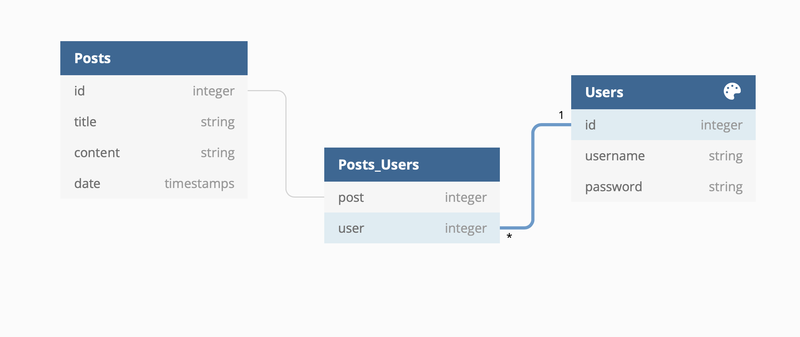

# Z-prefix-project-Farias

## Frontend

### User-Stories

#### The Blogger:
* Create an account for blog creation (credentials must be salted & hashed)
* Log-in to account to see posts
* Upon logging in, wants to be automatically redirected to their user page
* Should be able to create new posts
* When a post is made, user should be redirected to their user page
* A user's post should display the title, content, and date of creation
* Only the first 100 characters of displayed posts should be visible (if more than 100 char, ... should be present)
* The selection of one of the users post should bring them to an individual post
* Posts should be able to be edited
* When in editing mode, the page should remain the same, with just the different fields becoming editable
* Posts should be able to be deleted
* After post deletion the user should be taken back to their user page
* Should be able to navigate to a homepage contain all users posts

#### The Visitor:
* The homepage should show all of the posts created by all users
* The visitor should be able to click on a post to view all of its content
* Posts should only display first 100 char with ... at the end if longer

### Routes 
- /bloggeropolis
- /bloggeropolis/login
- /bloggeropolis/{userId}
- /bloggeropolis/{userId}/{postId}
- /bloggeropolis/single/{postId}

### Pages

#### Blog Feed page
- Should show all posts from all of the different users
- Displayed Posts Should be clickable
- Should have a navbar with links to:
    - login
    - blog feed
    - homepage

#### Login Page
- Should be accessible through the site's navbar
- Should allow users to login
- Should allow visitors to create an account
- Should have fields to accept both a username and password
- Should have a submit button and a create Account button
- If a password/username are not found should return an error

#### Homepage
- Should display all of a users post
- Should have a create new post button
- Displayed posts should be clickable

#### Individual Post page
- Should have a toggle for editing post
- Should have a delete button which redirects back to user page after deletion
- Should have a back button back to user/blog feed page
- If user is not connected to post, delete and edit buttons should be hidden

## Backend

### Schema

## Endpoints
- GET:
    - /blogs: should return all of user blogs in database with content being limited to 100 char
    - /blogs/:userId: should return all blogs from a single user content being limited to 100 char
    - /blogs/{postId}: should grab all of a single blogs content and associated user
- PATCH
    - /blogs/:postId: will update title and content of a post
- POST
    - /login: allows a user to login using a username and password
    - /create: allows a visitor to create an account with a username and password
    - /blogs/:userId: allows a user to create a new post with title and context submissions
- DELETE
    - /blogs/:postId: will delete post from database
